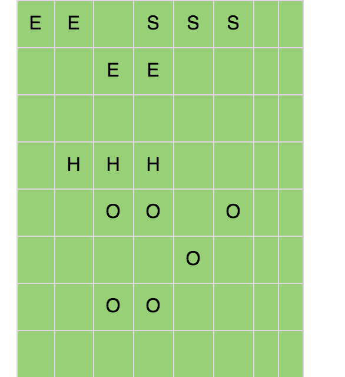
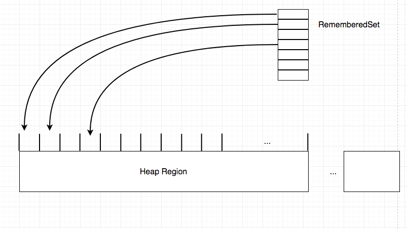

# G1简介

转自： https://liuzhengyang.github.io/2017/06/07/garbage-first-collector/

Garbage First Collector, 简称G1 Collector，是HotspotJDK1.7后提供的面向大内存(Heap区数G到数10G)、多核系统的收集器，能够实现软停顿目标收集并且具有高吞吐量, 具有更可预测的停顿时间。一些基本的垃圾收集的概念和术语可以参考我之前的一篇[理解GC(垃圾回收算法和原理)](https://liuzhengyang.github.io/2017/04/01/understandinggarbagecollect/)。

G1是一种并发、并行、部分Stop The World、使用Copying算法收集的分代的增量式收集器，
G1的全堆的操作，像global marking，是和应用(mutator)并发执行的，这样可以减少对mutator的暂停时间。清除阶段则使用多线程来提高吞吐量。
与Hotspot之前的Serial、Parallel、CMS等收集器不同的是，G1将堆分为很多大小相等的Region, 每次收集时会判断各个Region的活性-即垃圾对象的占比，垃圾对象占比越多的Region回收的收益越大，然后G1会按照设置的停顿时间目标、前几次回收Region所用时间来估算要回收哪些Region,即用最小的时间获取最大的收益，这也是Garbage First名字的含义。
Garbage First Collector的使命是在未来替换CMS，并且在JDK1.9已经成为默认的收集器。


# 为什么需要G1

Hotspot之前已经携带了Serial, Paralel, CMS等收集器，为什么还需要研发一个新的G1呢？垃圾收集的三个性能指标: footprint, max pause time, throughput似乎像CAP一样不能同时满足。
在服务端更注重的是短停顿时间，也就是stop-the-world的时间，另外一段时间内的总停顿时间也是一个衡量指标。
Mark-Sweep, Mark-Compact均需要和清理区域大小成比例的工作量，而Copying算法则需要一般是一半的空间用于存放每次copy的活对象。CMS的Initial Marking和Remarking两个STW阶段在Heap区越来越大的情况下需要的时间越长，并且由于内存碎片，需要压缩的话也会造成较长停顿时间。所以需要一种高吞吐量的短暂停时间的收集器，而不管堆内存多大。

# G1的实现方式

## Region

避免长暂停时间，可以考虑将堆分成多个部分，一次收集其中一部分，这样的方式又叫做增量收集(incremental collection), 分代收集也可以看成一种特殊的增量收集。
G1收集器将堆内存划分为一系列大小相等的Region区域，Region大小在1MB到32MB在启动时确定，G1同样也使用分代收集策略，将堆分为Eden, Survivior, Old等，只不过是按照逻辑划分的，每个Region逻辑上属于一个分代区域，并且在物理上不连续，当一个Old的Region收集完成后会变成新可用Region并可能成为下一个Eden Region。当申请的对象大于Region大小的一半时，会被放入一个Humongous Region(巨型区域)中。当一个Region中是空的时，称为可用Region或新Region。
[](https://liuzhengyang.github.io/images/g1region.jpg)
图片中E指Eden, S是Survivor, H指Humongous, O是Old, 空白区域是可用分区。

## CardTable

因为G1只回收一部分Region, 所以回收的时候需要知道哪些其他Region的对象引用着自己Region的对象，因为采用的copying算法需要移动对象，所以要更新引用为对象的新地址，在普通的分代收集中也是如此，分代收集中年轻代收集需要老年代到年轻代的引用的记录，通常叫做remembered set(简称RS)。CardTable是一种remembered set, 一个card代表一个范围的内存，目前采用512bytes表示一个card，cardtable就是一个byte数组，每个Region有自己的cardtable。维护remembered set需要mutator线程在可能修改跨Region的引用的时候通知collector, 这种方式通常叫做write barrier(和GC中的Memory Barrier不同), 每个线程都会有自己的remembered set log,相当于各自的修改的card的缓冲buffer,除此之外还有全局的buffer, mutator自己的remember set buffer满了之后会放入到全局buffer中，然后创建一个新的buffer。
[](https://liuzhengyang.github.io/images/g1cardtable.jpg)
只有来自其他Region的引用需要记录在RS中，所以Region内部的引用和null都不需要记录RS。

## 收集过程分类

## Marking

G1收集器的标记阶段负责标记处存活的对象、并且计算各个Region的活跃度等。
G1使用了一种Snaphot-At-The-Beginning简称SATB的标记算法, 记录标记开始时的对象图的快照，之后并发收集过程中的新申请的对象都认为是存活对象, 当堆使用比例超过InitiatingHeapOccupancyPercent后开始marking阶段，使用SATB记录marking开始阶段的对象图快照，。
G1使用bitmap标记处哪些位置已经完成标记了，一个bitmap的bit表示8bytes, 我们使用两个marking bitmap，一个previous、一个next, previous marking bitmap表示已经完成标记的部分，标记完成后会交换previous和next
标记阶段分为几个步骤。

### Initial Marking Phase

标记周期的最开始是清除next marking bitmap，是并发执行的。然后开始initial marking phase, 会暂停所有线程，标记出所有可以直接从GC roots可以到达的对象，这是在Young GC的暂停收集阶段顺带进行的。

### Root Region Scan Phase

找出所有的GC Roots的Region, 然后从这些Region开始标记可到达的对象，是一个并发阶段。

### Concurrent Marking Phase

这个阶段G1通过tracing找出整个堆所有的可到达的对象。这个阶段是并发执行的。

### Remark Phase

Remark是一个STW阶段，G1将所有的SATB buffer处理完成。

### Cleanup Phase

marking的最后一个阶段，G1统计各个Region的活跃性，完全没有存活对象的Region直接放入空闲可用Region列表中，然后会找出mixed GC的Region候选列表。

# 收集过程

和一般的分代式收集不同，G1中除了普通的Young GC，还有Mixed GC。

## Young Garbage Collection

当Eden区域无法申请新的对象时（满了），就会进行Young GC, Young GC将Eden和Survivor区域的Region(称为Collection Set, CSet)中的活对象Copy到一些新Region中(即新的Survivor)，当对象的GC年龄达到阈值后会Copy到Old Region中。由于采取的是Copying算法，所以就避免了内存碎片的问题，不再需要单独的压缩。

## Mixed Garbage Collection

当old区Heap的对象占总Heap的比例超过InitiatingHeapOccupancyPercent之后，就会开始ConcurentMarking, 完成了Concurrent Marking后，G1会从Young GC切换到Mixed GC, 在Mixed GC中，G1可以增加若干个Old区域的Region到CSet中。
Mixed GC的次数根据候选的Old CSet和每次回收的

## Full GC

和CMS一样，G1的一些收集过程是和应用程序并发执行的，所以可能还没有回收完成，是由于申请内存的速度比回收速度快，新的对象就占满了所有空间，在CMS中叫做Concurrent Mode Failure, 在G1中称为Allocation Failure，也会降级为一个STW的fullgc。

## Floating Garbage

G1使用一种Snapshot-At-The-Begining的方式记录活对象，也就是那一时刻(整个堆concurrent marking开始的时候)的内存的Object graph, 但是在之后这里面的对象可能会变成Garbage, 叫做floating garbage 只能等到下一次收集回收掉。

# 总结

G1的特点有，将Heap分为大小相等的Region，逻辑分代，Marking的大部分是并发的，STW中大部分采取多线程并行执行，采用Copying进行多线程并行收集。

# G1常见的调节参数

```
-Xmx -Xms
```

和其他收集器一样，是配置堆的最大大小和初始大小

```
-XX:MaxGCPauseMillis=200
```

GC最大暂停时间，默认200ms

```
-XX:InitiatingHeapOccupancyPercent=45
```

开始一个标记周期的堆占用比例阈值，默认45%，注意这里是整个堆，不同于CMS中的Old堆比例。

```
-XX:G1HeapRegionSize=n
```

设置每个Region的大小，这里需要是1MB到32MB的2的指数的大小。

# 推荐使用G1的场景

个人认为更换GC或者进行调优只能算是系统的锦上添花，并不能作为主要解决系统性能问题的关键，出现内存问题时，应当以修改应用代码为主、编写清晰的GC友好的代码，选择与应用场景合适的收集器可以提高系统的性能。
现在推荐从CMS更换到G1的一些情况如下:

- Java堆的50%以上都是活对象
- 对象的分配速率变化很大
- 由于old gc或压缩导致不可忍受的长时间的暂停

# G1在生产环境中的使用实践和日志分析

在JDK1.8上从CMS切换到G1, 只需要更换启动参数即可。

```
-XX:+UseG1GC
```


从gc监控和gc日志来看，没有明显大的变化，总体上出现的Full gc更少了。下面是一段GC日志。

```
// JVM、机器等信息
Java HotSpot(TM) 64-Bit Server VM (25.45-b02) for linux-amd64 JRE (1.8.0_45-b14), built on Apr 10 2015 10:07:45 by "java_re" with gcc 4.3.0 20080428 (Red Hat 4.3.0-8)
// 内存信息
Memory: 4k page, physical 8059416k(2486228k free), swap 2096440k(2096440k free)
// 启动时参数
CommandLine flags: -XX:+DisableExplicitGC -XX:ErrorFile=/xxx/xxx -XX:G1LogLevel=finest -XX:+G1PrintRegionLivenessInfo -XX:+G1SummarizeConcMark -XX:+HeapDumpOnOutOfMemoryError -XX:HeapDumpPath=/var/xxx/logs/xxxx/xxxx.heaperr.log.201706051331 -XX:InitialHeapSize=128950656 -XX:MaxHeapSize=2063210496 -XX:+PrintAdaptiveSizePolicy -XX:+PrintFlagsFinal -XX:+PrintGC -XX:+PrintGCApplicationConcurrentTime -XX:+PrintGCApplicationStoppedTime -XX:+PrintGCDateStamps -XX:+PrintGCDetails -XX:+PrintGCTimeStamps -XX:+PrintHeapAtGC -XX:+PrintTenuringDistribution -XX:+UnlockDiagnosticVMOptions -XX:+UnlockExperimentalVMOptions -XX:+UseCompressedClassPointers -XX:+UseCompressedOops -XX:+UseG1GC
// 因为启动参数中Xms和Xmx不相等，所以G1根据其他参数判断需要进行扩容，进行了heap扩容
 0.038: [G1Ergonomics (Heap Sizing) expand the heap, requested expansion amount: 130023424 bytes, attempted expansion amount: 130023424 bytes]
2017-06-05T13:31:19.764+0800: 0.779: Application time: 0.4628680 seconds
2017-06-05T13:31:19.764+0800: 0.779: Total time for which application threads were stopped: 0.0001855 seconds, Stopping threads took: 0.0000637 seconds
2017-06-05T13:31:19.892+0800: 0.907: Application time: 0.1276311 seconds
2017-06-05T13:31:19.892+0800: 0.907: Total time for which application threads were stopped: 0.0001424 seconds, Stopping threads took: 0.0000359 seconds
2017-06-05T13:31:20.176+0800: 1.191: Application time: 0.2839383 seconds
// GC前打印的Heap信息
{Heap before GC invocations=0 (full 0):
 garbage-first heap   total 126976K, used 14336K [0x0000000085000000, 0x00000000851003e0, 0x0000000100000000)
  region size 1024K, 14 young (14336K), 0 survivors (0K)
 Metaspace       used 8432K, capacity 8590K, committed 8704K, reserved 1056768K
  class space    used 899K, capacity 921K, committed 1024K, reserved 1048576K
// Young GC的清理暂停
2017-06-05T13:31:20.176+0800: 1.191: [GC pause (G1 Evacuation Pause) (young)
Desired survivor size 1048576 bytes, new threshold 15 (max 15)
// 选择要Collect的Region, 构成Collection Set，CSet
 1.191: [G1Ergonomics (CSet Construction) start choosing CSet, _pending_cards: 0, predicted base time: 10.00 ms, remaining time: 190.00 ms, target pause time: 200.00 ms]
 // 选择了 14个Eden, 0个Survivor
 1.191: [G1Ergonomics (CSet Construction) add young regions to CSet, eden: 14 regions, survivors: 0 regions, predicted young region time: 356.52 ms]
 1.191: [G1Ergonomics (CSet Construction) finish choosing CSet, eden: 14 regions, survivors: 0 regions, old: 0 regions, predicted pause time: 366.52 ms, target pause time: 200.00 ms]
 , 0.0055898 secs]
   [Parallel Time: 4.2 ms, GC Workers: 4]
      [GC Worker Start (ms):  1191.5  1191.5  1193.8  1195.6
       Min: 1191.5, Avg: 1193.1, Max: 1195.6, Diff: 4.2]
      [Ext Root Scanning (ms):  1.3  1.3  0.0  0.0
       Min: 0.0, Avg: 0.7, Max: 1.3, Diff: 1.3, Sum: 2.6]
      [Update RS (ms):  0.0  0.0  0.0  0.0
       Min: 0.0, Avg: 0.0, Max: 0.0, Diff: 0.0, Sum: 0.0]
         [Processed Buffers:  0  0  0  0
          Min: 0, Avg: 0.0, Max: 0, Diff: 0, Sum: 0]
      [Scan RS (ms):  0.0  0.0  0.0  0.0
       Min: 0.0, Avg: 0.0, Max: 0.0, Diff: 0.0, Sum: 0.0]
      [Code Root Scanning (ms):  0.4  0.1  0.0  0.0
       Min: 0.0, Avg: 0.1, Max: 0.4, Diff: 0.4, Sum: 0.5]
      [Object Copy (ms):  2.4  2.7  1.7  0.0
       Min: 0.0, Avg: 1.7, Max: 2.7, Diff: 2.7, Sum: 6.7]
      [Termination (ms):  0.1  0.1  0.1  0.0
       Min: 0.0, Avg: 0.1, Max: 0.1, Diff: 0.1, Sum: 0.3]
         [Termination Attempts:  1  3  1  1
          Min: 1, Avg: 1.5, Max: 3, Diff: 2, Sum: 6]
      [GC Worker Other (ms):  0.0  0.0  0.0  0.0
       Min: 0.0, Avg: 0.0, Max: 0.0, Diff: 0.0, Sum: 0.1]
      [GC Worker Total (ms):  4.2  4.2  1.8  0.0
       Min: 0.0, Avg: 2.5, Max: 4.2, Diff: 4.2, Sum: 10.2]
      [GC Worker End (ms):  1195.6  1195.6  1195.6  1195.6
       Min: 1195.6, Avg: 1195.6, Max: 1195.6, Diff: 0.0]
   [Code Root Fixup: 0.1 ms]
   [Code Root Purge: 0.0 ms]
   [Clear CT: 0.1 ms]
    [Clear CT: 0.1 ms]
   [Other: 1.1 ms]
      [Choose CSet: 0.0 ms]
      [Ref Proc: 0.8 ms]
      [Ref Enq: 0.0 ms]
      [Redirty Cards: 0.1 ms]
         [Parallel Redirty:  0.0  0.0  0.0  0.0
          Min: 0.0, Avg: 0.0, Max: 0.0, Diff: 0.0, Sum: 0.0]
         [Redirtied Cards:  885  0  0  0
          Min: 0, Avg: 221.2, Max: 885, Diff: 885, Sum: 885]
      [Humongous Reclaim: 0.0 ms]
         [Humongous Total: 0]
         [Humongous Candidate: 0]
         [Humongous Reclaimed: 0]
      [Free CSet: 0.0 ms]
         [Young Free CSet: 0.0 ms]
         [Non-Young Free CSet: 0.0 ms]
   [Eden: 14.0M(14.0M)->0.0B(18.0M) Survivors: 0.0B->2048.0K Heap: 14.0M(124.0M)->4016.5K(124.0M)]
Heap after GC invocations=1 (full 0):
 garbage-first heap   total 126976K, used 4016K [0x0000000085000000, 0x00000000851003e0, 0x0000000100000000)
  region size 1024K, 2 young (2048K), 2 survivors (2048K)
 Metaspace       used 8432K, capacity 8590K, committed 8704K, reserved 1056768K
  class space    used 899K, capacity 921K, committed 1024K, reserved 1048576K
}
 [Times: user=0.01 sys=0.00, real=0.00 secs]
2017-06-05T13:31:20.182+0800: 1.197: Total time for which application threads were stopped: 0.0059362 seconds, Stopping threads took: 0.0000589 seconds


// G1 请求开始并发标记周期, 原因是内存占用比例超过了阈值
 [G1Ergonomics (Concurrent Cycles) request concurrent cycle initiation, reason: occupancy higher than threshold, occupancy: 63963136 bytes, allocation request: 0 bytes, threshold: 58510530 bytes (45.00 %), source: end of GC]
, 0.0152145 secs]
   [Parallel Time: 10.3 ms, GC Workers: 4]
      [GC Worker Start (ms):  5509.1  5509.1  5514.1  5519.3
       Min: 5509.1, Avg: 5512.9, Max: 5519.3, Diff: 10.2]
      [Ext Root Scanning (ms):  0.4  0.3  0.0  0.0
       Min: 0.0, Avg: 0.2, Max: 0.4, Diff: 0.4, Sum: 0.7]
      [Update RS (ms):  1.5  1.8  0.0  0.0
       Min: 0.0, Avg: 0.8, Max: 1.8, Diff: 1.8, Sum: 3.3]
         [Processed Buffers:  9  6  0  0
          Min: 0, Avg: 3.8, Max: 9, Diff: 9, Sum: 15]
      [Scan RS (ms):  0.6  0.3  0.0  0.0
       Min: 0.0, Avg: 0.2, Max: 0.6, Diff: 0.6, Sum: 0.9]
      [Code Root Scanning (ms):  0.0  0.0  0.0  0.0
       Min: 0.0, Avg: 0.0, Max: 0.0, Diff: 0.0, Sum: 0.0]
      [Object Copy (ms):  2.5  2.4  0.0  0.0
       Min: 0.0, Avg: 1.2, Max: 2.5, Diff: 2.5, Sum: 4.9]
      [Termination (ms):  5.3  5.3  5.2  0.0
       Min: 0.0, Avg: 3.9, Max: 5.3, Diff: 5.3, Sum: 15.7]
         [Termination Attempts:  1  1  1  1
          Min: 1, Avg: 1.0, Max: 1, Diff: 0, Sum: 4]
      [GC Worker Other (ms):  0.0  0.0  0.0  0.0
       Min: 0.0, Avg: 0.0, Max: 0.0, Diff: 0.0, Sum: 0.0]
      [GC Worker Total (ms):  10.2  10.2  5.2  0.0

      ...
// 开始并发周期
       5.696: [G1Ergonomics (Concurrent Cycles) initiate concurrent cycle, reason: concurrent cycle initiation requested]
// Young GC中顺带执行的initial-mark
2017-06-05T11:26:22.512+0800: 5.696: [GC pause (G1 Evacuation Pause) (young) (initial-mark)
...
// root region scan
2017-06-05T11:26:22.538+0800: 5.722: [GC concurrent-root-region-scan-start]
2017-06-05T11:26:22.540+0800: 5.724: [GC concurrent-root-region-scan-end, 0.0015848 secs]
// concurrent mark
2017-06-05T11:26:22.540+0800: 5.724: [GC concurrent-mark-start]
2017-06-05T11:26:22.540+0800: 5.724: Total time for which application threads were stopped: 0.0281922 seconds, Stopping threads took: 0.0000381 seconds
2017-06-05T11:26:22.582+0800: 5.766: [GC concurrent-mark-end, 0.0416350 secs]
2017-06-05T11:26:22.582+0800: 5.766: Application time: 0.0417029 seconds
// remark
2017-06-05T11:26:22.582+0800: 5.766: [GC remark 5.766: [Finalize Marking, 0.0002957 secs] 5.766: [GC ref-proc, 0.0039387 secs] 5.770: [Unloading 5.770: [System Dictionary Unloading, 0.0000263 secs] 5.770: [Parallel Unloading, 0.0046529 secs] 5.775: [Deallocate Metadata, 0.0000266 secs], 0.0049240 secs], 0.0094765 secs]
 [Times: user=0.03 sys=0.00, real=0.01 secs]
2017-06-05T11:26:22.591+0800: 5.775: Total time for which application threads were stopped: 0.0096170 seconds, Stopping threads took: 0.0000400 seconds
2017-06-05T11:26:22.592+0800: 5.776: Application time: 0.0004581 seconds
// cleanup
2017-06-05T11:26:22.592+0800: 5.776: [GC cleanup
// 统计出了各个Region的收集效率
### PHASE Post-Marking @ 5.776
### HEAP  reserved: 0x0000000085000000-0x0000000100000000  region-size: 1048576
###
###   type                         address-range       used  prev-live  next-live          gc-eff     remset  code-roots
###                                                 (bytes)    (bytes)    (bytes)      (bytes/ms)    (bytes)    (bytes)
###   OLD  0x0000000085000000-0x0000000085100000    1048576    1048576     245296             0.0       4216        408
###   OLD  0x0000000085100000-0x0000000085200000    1048576    1048576     154904             0.0      21376       5424
###   OLD  0x0000000085200000-0x0000000085300000    1048576    1048576    1024728             0.0      30904       8520
###   OLD  0x0000000085300000-0x0000000085400000    1048576    1048576     669968             0.0       5072        576
###   OLD  0x0000000085400000-0x0000000085500000    1048576    1048576       6888             0.0       3136         16
###   OLD  0x0000000085500000-0x0000000085600000    1048576    1048576          0             0.0       3136         16
###   OLD  0x0000000085600000-0x0000000085700000    1048576    1048576          0             0.0       3136         16
###   OLD  0x0000000085700000-0x0000000085800000    1048576    1048576          0             0.0       3136         16
###   OLD  0x0000000085800000-0x0000000085900000    1048576    1048576          0             0.0       3136         16
###   OLD  0x0000000085900000-0x0000000085a00000    1048576    1048576          0             0.0       3136         16
###   OLD  0x0000000085a00000-0x0000000085b00000    1048576    1048576          0             0.0       3136         16
###   OLD  0x0000000085b00000-0x0000000085c00000    1048576    1048576          0             0.0       3136         16
###   OLD  0x0000000085c00000-0x0000000085d00000    1048576    1048576          0             0.0       3136         16
###   OLD  0x0000000085d00000-0x0000000085e00000    1048576    1048576     501136             0.0      11088       2016
...
###   OLD  0x000000008a000000-0x000000008a100000     524296     524296       2576             0.0       3136         16
###   FREE 0x000000008a100000-0x000000008a200000          0          0          0             0.0       3136         16
###   SURV 0x000000008a200000-0x000000008a300000    1048576    1048576    1048576             0.0       4168         16
###   SURV 0x000000008a300000-0x000000008a400000    1048576    1048576    1048576             0.0       3824         16
###   SURV 0x000000008a400000-0x000000008a500000    1048576    1048576    1048576             0.0       3824         16
###   SURV 0x000000008a500000-0x000000008a600000    1048576    1048576    1048576             0.0       3824         16
###   SURV 0x000000008a600000-0x000000008a700000    1048576    1048576    1048576             0.0       7368         16
###   SURV 0x000000008a700000-0x000000008a800000    1048576    1048576    1048576             0.0       9088         16
###   FREE 0x000000008a800000-0x000000008a900000          0          0          0             0.0       3136         16
###   FREE 0x000000008a900000-0x000000008aa00000          0          0          0             0.0       3136         16
###   EDEN 0x000000008c900000-0x000000008ca00000    1048576    1048576    1048576             0.0       3136         16
###   EDEN 0x000000008ca00000-0x000000008cb00000    1048576    1048576    1048576             0.0       3136         16
###   EDEN 0x000000008cb00000-0x000000008cc00000    1048576    1048576    1048576             0.0       3136         16

### SUMMARY  capacity: 124.00 MB  used: 82.50 MB / 66.53 %  prev-live: 82.50 MB / 66.53 %  next-live: 44.85 MB / 36.17 %  remset: 0.64 MB  code-roots: 0.02 MB
2017-06-05T11:26:22.595+0800: 5.779: Application time: 0.0020252 seconds
2017-06-05T11:26:22.595+0800: 5.779: [GC concurrent-cleanup-start]
2017-06-05T11:26:22.595+0800: 5.779: [GC concurrent-cleanup-end, 0.0000586 secs]

 5.899: [G1Ergonomics (Concurrent Cycles) do not request concurrent cycle initiation, reason: still doing mixed collections, occupancy: 65011712 bytes, allocation request: 0 bytes, threshold: 58510530 bytes (45.00 %), source: end of GC]
 // 开始mixed GC，因为有Concurrent Mark阶段添加的old region候选
 5.899: [G1Ergonomics (Mixed GCs) start mixed GCs, reason: candidate old regions available, candidate old regions: 29 regions, reclaimable: 15030208 bytes (11.56 %), threshold: 5.00 %]
, 0.0136069 secs]
   [Parallel Time: 9.0 ms, GC Workers: 4]
      [GC Worker Start (ms):  5885.7  5885.7  5889.8  5889.8
       Min: 5885.7, Avg: 5887.7, Max: 5889.8, Diff: 4.1]
      [Ext Root Scanning (ms):  0.3  0.3  0.0  0.0
       Min: 0.0, Avg: 0.2, Max: 0.3, Diff: 0.3, Sum: 0.7]
      [Update RS (ms):  3.0  3.0  0.0  0.0
       Min: 0.0, Avg: 1.5, Max: 3.0, Diff: 3.0, Sum: 6.0]
         [Processed Buffers:  9  7  0  0

...
// 收集够足够的内存后，取消 mixed GC回退到了 Young GC。
5.920: [G1Ergonomics (Mixed GCs) do not continue mixed GCs, reason: reclaimable percentage not over threshold, candidate old regions: 17 regions, reclaimable: 6121168 bytes (4.71 %), threshold: 5.00 %]
, 0.0069783 secs]
```