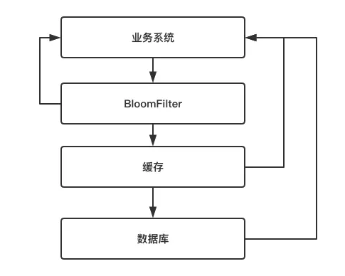

## 面试题
了解什么是 redis 的雪崩和穿透？redis 崩溃之后会怎么样？系统该如何应对这种情况？如何处理 redis 的穿透？

## 面试官心理分析
其实这是问到缓存必问的，因为缓存雪崩和穿透，是缓存最大的两个问题，要么不出现，一旦出现就是致命性的问题，所以面试官一定会问你。

## 面试题剖析
### 缓存雪崩
对于系统 A，假设每天高峰期每秒 5000 个请求，本来缓存在高峰期可以扛住每秒 4000 个请求，但是缓存机器意外发生了全盘宕机。缓存挂了，此时 1 秒 5000 个请求全部落数据库，数据库必然扛不住，它会报一下警，然后就挂了。此时，如果没用什么特别的方案来处理这个故障，DBA 很着急，重启数据库，但是数据库立马又被新的流量给打死了。

这就是缓存雪崩。


缓存雪崩的事前事中事后的解决方案如下。
- 事前：redis 高可用，主从+哨兵，redis cluster，避免全盘崩溃。
- 事中：本地 ehcache 缓存 + hystrix 限流&降级，避免 MySQL 被打死。
- 事后：redis 持久化，一旦重启，自动从磁盘上加载数据，快速恢复缓存数据。


用户发送一个请求，系统 A 收到请求后，先查本地 ehcache 缓存，如果没查到再查 redis。如果 ehcache 和 redis 都没有，再查数据库，将数据库中的结果，写入 ehcache 和 redis 中。

限流组件，可以设置每秒的请求，有多少能通过组件，剩余的未通过的请求，怎么办？**走降级**！可以返回一些默认的值，或者友情提示，或者空白的值。

好处：
- 数据库绝对不会死，限流组件确保了每秒只有多少个请求能通过。
- 只要数据库不死，就是说，对用户来说，2/5 的请求都是可以被处理的。
- 只要有 2/5 的请求可以被处理，就意味着你的系统没死，对用户来说，可能就是点击几次刷不出来页面，但是多点几次，就可以刷出来一次。

### 缓存穿透
对于系统A，假设一秒 5000 个请求，结果其中 4000 个请求是黑客发出的恶意攻击。

黑客发出的那 4000 个攻击，缓存中查不到，每次你去数据库里查，也查不到。

举个栗子。数据库 id 是从 1 开始的，结果黑客发过来的请求 id 全部都是负数。这样的话，缓存中不会有，请求每次都“视缓存于无物”，直接查询数据库。这种恶意攻击场景的缓存穿透就会直接把数据库给打死。


**解决方式很简单**

1.缓存空数据

​	每次系统 A 从数据库中只要没查到，就写一个空值到缓存里去，比如 `set -999 UNKNOWN`。这样的话，下次便能走缓存了。

2.BloomFilter

​	第二种避免缓存穿透的方式即为使用BloomFilter。

它需要在缓存之前再加一道屏障，里面存储目前数据库中存在的所有key，如下图所示：



当业务系统有查询请求的时候，首先去BloomFilter中查询该key是否存在。若不存在，则说明数据库中也不存在该数据，因此缓存都不要查了，直接返回null。若存在，则继续执行后续的流程，先前往缓存中查询，缓存中没有的话再前往数据库中的查询。

**两种方案的比较**

这两种方案都能解决缓存穿透的问题，但使用场景却各不相同。

对于一些恶意攻击，查询的key往往各不相同，而且数据贼多。此时，第一种方案就显得提襟见肘了。因为它需要存储所有空数据的key，而这些恶意攻击的key往往各不相同，而且同一个key往往只请求一次。因此即使缓存了这些空数据的key，由于不再使用第二次，因此也起不了保护数据库的作用。 因此，对于**空数据的key各不相同**、**key重复请求概率低**的场景而言，应该选择第二种方案。而对于**空数据的key数量有限**、**key重复请求概率较高**的场景而言，应该选择第一种方案。


#### - [缓存击穿]（https://tech.meituan.com/2016/12/02/performance-tunning.html）

对于一些设置了过期时间的key，如果这些key可能会在某些时间点被超高并发地访问，是一种非常“热点”的数据。这个时候，需要考虑另外一个问题：缓存被**“击穿”**的问题。

- 概念：缓存在某个时间点过期的时候，恰好在这个时间点对这个Key有大量的并发请求过来，这些请求发现缓存过期一般都会从后端DB加载数据并回设到缓存，这个时候大并发的请求可能会瞬间把后端DB压垮。

- 如何解决：

  - 业界比较常用的做法，是使用mute（互斥锁）

    简单地来说，就是在缓存失效的时候（判断拿出来的值为空），不是立即去load db，而是先使用缓存工具的某些带成功操作返回值的操作（比如Redis的SETNX或者Memcache的ADD）去set一个mutex key，当操作返回成功时，再进行load db的操作并回设缓存；否则，就重试整个get缓存的方法。类似下面的代码：

  ```java
  public String get(key) {
      String value = redis.get(key);
      if (value == null) { //代表缓存值过期
          //设置3min的超时，防止del操作失败的时候，下次缓存过期一直不能load db
          if (redis.setnx(key_mutex, 1, 3 * 60) == 1) {  //代表设置成功
              value = db.get(key);
                      redis.set(key, value, expire_secs);
                      redis.del(key_mutex);
              } else {  //这个时候代表同时候的其他线程已经load db并回设到缓存了，这时候重试获取缓存值即可
                      sleep(50);
                      get(key);  //重试
              }
          } else {
              return value;      
          }
  }
  ```

  - 设置不同的失效时间

当我们向缓存中存储这些数据的时候，可以将他们的缓存失效时间错开。这样能够避免同时失效。如：在一个基础时间上加/减一个随机数，从而将这些缓存的失效时间错开。