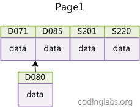

# InnoDB的主键选择与插入优化

在使用InnoDB存储引擎时，如果没有特别的需要，请永远使用一个与业务无关的自增字段作为主键。

经常看到有帖子或博客讨论主键选择问题，有人建议使用业务无关的自增主键，有人觉得没有必要，完全可以使用如学号或身份证号这种唯一字段作为主键。不论支持哪种论点，大多数论据都是业务层面的。如果从数据库索引优化角度看，使用InnoDB引擎而不使用自增主键绝对是一个糟糕的主意。

上文讨论过InnoDB的索引实现，InnoDB使用聚集索引，数据记录本身被存于主索引（一颗B+Tree）的叶子节点上。这就要求同一个叶子节点内（大小为一个内存页或磁盘页）的各条数据记录按主键顺序存放，因此每当有一条新的记录插入时，MySQL会根据其主键将其插入适当的节点和位置，如果页面达到装载因子（InnoDB默认为15/16），则开辟一个新的页（节点）。

如果表使用自增主键，那么每次插入新的记录，记录就会顺序添加到当前索引节点的后续位置，当一页写满，就会自动开辟一个新的页。如下图所示：

图13

这样就会形成一个紧凑的索引结构，近似顺序填满。由于每次插入时也不需要移动已有数据，因此效率很高，也不会增加很多开销在维护索引上。

如果使用非自增主键（如果身份证号或学号等），由于每次插入主键的值近似于随机，因此每次新纪录都要被插到现有索引页得中间某个位置：

图14

此时MySQL不得不为了将新记录插到合适位置而移动数据，甚至目标页面可能已经被回写到磁盘上而从缓存中清掉，此时又要从磁盘上读回来，这增加了很多开销，同时频繁的移动、分页操作造成了大量的碎片，得到了不够紧凑的索引结构，后续不得不通过OPTIMIZE TABLE来重建表并优化填充页面。

因此，只要可以，请尽量在InnoDB上采用自增字段做主键。