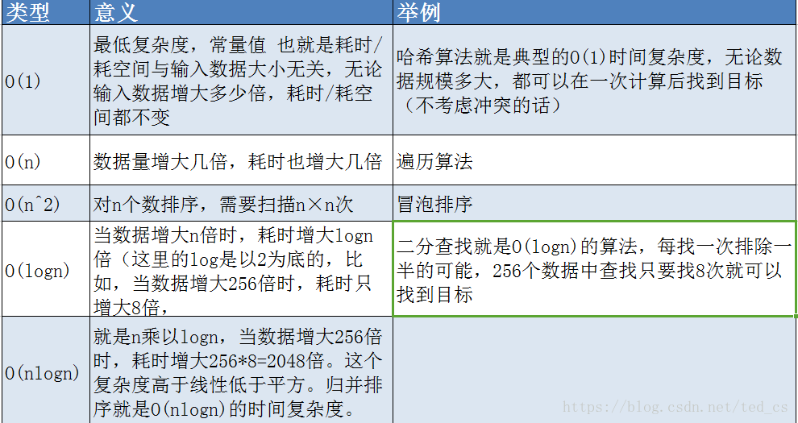
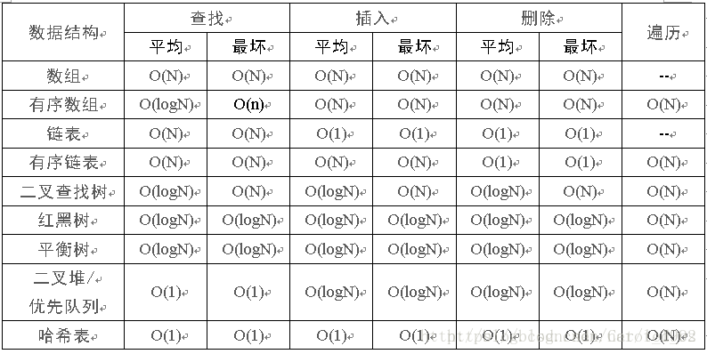

## 1.时间复杂度解释

先从  来说，理论上哈希表就是O(1)。因为哈希表是通过哈希函数来映射的，所以拿到一个关键字，用哈希函数转换一下，就可以直接从表中取出对应的值。和现存数据有多少毫无关系，故而每次执行该操作只需要恒定的时间（当然，实际操作中存在冲突和冲突解决的机制，不能保证每次取值的时间是完全一样的）。举个现实的例子，比如我的身后有一排柜子，里面有香蕉（代号B），苹果（代号A），葡萄（G），现在你说A，我迅速的就把苹果递过来了；你说B，我迅速就把香蕉递过来了。就算你再增加菠萝（P）、火龙果(H)，但是你说一个代号，我递给你相应的水果这个速度是几乎不会变的。

至于  ，这个就是说随着样本数量的增加，复杂度也随之线性增加。典型的比如数数。如果一个人从1数到100，需要100秒，那么从1到200，基本上不会小于200秒，所以数数就是一个  复杂度的事情。一般来说，需要序贯处理的算法的复杂度，都不会低于  。比如说，如果我们要设计一个算法从一堆杂乱的考试的卷子里面找出最高的分数，这就需要我们从头到尾看完每一份试卷，显然试卷越多，需要的时间也越多，这就是一个  复杂度的算法。

而 是说，计算的复杂度随着样本个数的平方数增长。这个例子在算法里面，就是那一群比较挫的排序，比如冒泡、选择等等。沿着我们刚才的说的那个试卷的例子，等我们找出最高的分数之后，放在一边另起一堆，然后用同样的方法找第二高的分数，再放到新堆上…… 这样我们做n次，试卷就按照分数从低到高都排好了。因为有n份试卷，所以这种翻试卷，找最高分的行为，我们要做n次，每次的复杂度是  ,那么n个  自然就是 

在比如说构建一个网络，每个点都和其他的点相连。显然，每当我们增加一个点，其实就需要构建这个点和所有现存的点的连线，而现存的点的个数是n，所以每增加1，就需要增加n个连接，那么如果我们增加n个点呢，那这个连接的个数自然也就是  量级了。

无论是翻试卷，还是创建网络，每增加一份试卷，每增加一个点，都需要给算法执行人带来n量级的工作量，这种算法的复杂度就是  。

然后是  ，这恐怕是常见算法复杂度里面相对最难理解的，就是这个log怎么来的。前面那个n，代表执行了n次  的操作，所以理解了log(n)，就理解了nlog(n)。

 的算法复杂度，典型的比如二分查找。设想一堆试卷，已经从高到底按照分数排列了，我们现在想找到有没有59分的试卷。怎么办呢？先翻到中间，把试卷堆由中间分成上下两堆，看中间这份是大于还是小于59，如果大于，就留下上面那堆，别的丢掉，如果小于，就留下下面那堆，丢掉上面。然后按照同样的方法，每次丢一半的试卷，直到丢无可丢为止。

假如有32份试卷，你丢一次，还剩16份 ，丢两次，还剩下8 份，丢三次，就只剩下4份了，可以这么一直丢下去，丢到第五次，就只剩下一份了。而  。也就是我们一次丢一半，总要丢到只有一份的时候才能出结果，如果有n份，那么显然我们就有：

也就是大约需要  次，才能得出“找到”或者“没找到”的结果。当然你说你三分查找，每次丢三分之二可不可以？当然也可以，但是算法复杂度在这里是忽略常数的，所以不管以2为底，还是以什么数为底，都统一的写成  的形式。

理解了这一点，就可以理解快速排序为什么是  了。比如对一堆带有序号的书进行排序，怎么快呢？就是随便先选一本，然后把号码大于这本书的扔右边，小于这本书的扔左边。因为每本书都要比较一次，所以这么搞一次的复杂度是  ，那么快排需要我们搞多少次呢？这个又回到了二分查找的逻辑了，每次都把书堆一分为二，请问分多少次手里才能只剩下一本书呢？答案还是  。而从代码的角度来说，在到达大小为一的数列之前，我们也是需要作  次嵌套的调用。

## 2.常见排序算法时间空间复杂度

| 排序法   | 平均时间   | 最差时间                  | 最好时间   | 空间复杂度                           | 稳定度 | 复杂性 |
| -------- | ---------- | ------------------------- | ---------- | ------------------------------------ | ------ | ------ |
| 冒泡排序 | O(n2)      | O(n2)                     | O(n)       | O(1)                                 | 稳定   | 简单   |
| 选择排序 | O(n2)      | O(n2)                     | O(n2)      | O(1)                                 | 不稳定 | 简单   |
| 插入排序 | O(n2)      | O(n2)                     | O(n)       | O(1)                                 | 稳定   | 简单   |
| 希尔排序 | O(n*log2n) | O(n*log2n) / O(n*s) 1<s<2 |            | O(1)                                 | 不稳定 | 较复杂 |
| 快速排序 | O(n*log2n) | O(n2)                     | O(n*log2n) | O(log2n)~O(n)  / O(log2n)/O(n*log2n) | 不稳定 | 较复杂 |
| 堆排序   | O(n*log2n) | O(n*log2n)                | O(n*log2n) | O(1)                                 | 不稳定 | 较复杂 |
| 归并排序 | O(n*log2n) | O(n*log2n)                | O(n*log2n) | O(n)/O(1)                            | 稳定   | 较复杂 |
|          |            |                           |            |                                      |        |        |
|          |            |                           |            |                                      |        |        |
|          |            |                           |            |                                      |        |        |

