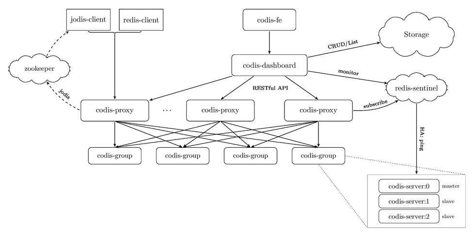

# [Codis—分布式Redis服务的解决方案](https://www.cnblogs.com/chenny7/p/5063368.html)

## 介绍

[Codis](https://github.com/wandoulabs/codis) 是豌豆荚公司开发的一个分布式 Redis 解决方案，用Go语言开发的。对于上层的应用来说，连接到 Codis Proxy 和连接原生的 Redis Server 没有明显的区别 （[不支持的命令列表](https://github.com/wandoulabs/codis/blob/master/doc/unsupported_cmds.md)），Codis 底层会处理请求的转发，不停机的数据迁移等工作。所有后边的一切事情，对于前面的客户端来说是透明的，可以简单的认为后边连接的是一个内存无限大的 Redis 服务。

### Codis (2.x) 由四部分组成:

- Codis Proxy (codis-proxy)

  ​	 处理客户端请求，支持Redis协议，因此客户端访问Codis Proxy跟访问原生Redis没有什么区别；

- Codis Dashboard (codis-config)

  ​	Codis 的管理工具，支持添加/删除 Redis 节点、添加/删除 Proxy 节点，发起数据迁移等操作。codis-config 本身还自带了一个 http server，会启动一个 dashboard，用户可以直接在浏览器上观察 Codis 集群的运行状态；

- Codis Redis (codis-server)

  ​	Codis 项目维护的一个 Redis 分支，基于 2.8.21 开发，加入了 slot 的支持和原子的数据迁移指令；

- ZooKeeper/Etcd

  ​	Codis 依赖 ZooKeeper 来存放数据路由表和 codis-proxy 节点的元信息，codis-config 发起的命令都会通过 ZooKeeper 同步到各个存活的 codis-proxy；

  

  Codis 支持按照 Namespace 区分不同的产品，拥有不同的 product name 的产品，各项配置都不会冲突。

  

### Codis (3.x)不同:

- Storage：为集群状态提供外部存储。仅存储集群元数据

- - 使用Namespace概念，不同集群按照product name组织。
  - 目前提供zookeeper、etcd、fs三种实现，但提供了接口可自行扩展

- Codis FE：集群管理界面 (Codis 3.x)

- - 前端展示页面可以集成多个集群实例
  - 通过配置文件管理后端 codis-dashboard 列表，配置文件可自动更新。
 


Codis 采用 Pre-sharding 的技术来实现数据的分片，默认分成 1024 个 slots (0-1023)，对于每个key来说，通过以下公式确定所属的 Slot Id：

```
SlotId = crc32(key) % 1024
```

每一个 slot 都会有一个且必须有一个特定的 server group id 来表示这个 slot 的数据由哪个 server group 来提供。数据的迁移也是以slot为单位的。

 

## 数据迁移（migrate）

安全和透明的数据迁移是 Codis 提供的一个重要的功能，也是 Codis 区别于 Twemproxy 等静态的分布式 Redis 解决方案的地方。

数据迁移的最小单位是 key，我们在 codis redis 中添加了一些指令，实现基于key的迁移，如 SLOTSMGRT等 (命令列表)，每次会将特定 slot 一个随机的 key 发送给另外一个 codis redis 实例，这个命令会确认对方已经接收，同时删除本地的这个 k-v 键值，返回这个 slot 的剩余 key 的数量，整个操作是原子的。

在 codis-config 管理工具中，每次迁移任务的最小单位是 slot。如: 将slot id 为 [0-511] 的slot的数据，迁移到 server group 2上，--delay 参数表示每迁移一个 key 后 sleep 的毫秒数，默认是 0，用于限速。

```
bin/codis-config slot migrate 0 511 2 --delay=10
```

迁移的过程对于上层业务来说是安全且透明的，数据不会丢失，上层不会中止服务。

注意，迁移的过程中打断是可以的，但是如果中断了一个正在迁移某个slot的任务，下次需要先迁移掉正处于迁移状态的 slot，否则无法继续 (即迁移程序会检查同一时刻只能有一个 slot 处于迁移状态)。

 

## 自动再平衡（auto rebalance）

Codis 支持动态的根据实例内存，自动对slot进行迁移，以均衡数据分布

```
bin/codis-config slot rebalance
```

要求:

- 所有的codis-server都必须设置了maxmemory参数；
- 所有的 slots 都应该处于 online 状态, 即没有迁移任务正在执行；
- 所有 server group 都必须有 Master；

 

## 高可用（2.x）

因为codis的proxy是无状态的，可以比较容易的搭多个proxy来实现高可用性并横向扩容。

对Java用户来说，可以使用经过我们修改过的Jedis，[Jodis](https://github.com/wandoulabs/jodis) ，来实现proxy层的HA。它会通过监控zk上的注册信息来实时获得当前可用的proxy列表，既可以保证高可用性，也可以通过轮流请求所有的proxy实现负载均衡。如果需要异步请求，可以使用我们基于Netty开发的[Nedis](https://github.com/wandoulabs/nedis)。

对下层的redis实例来说，当一个group的master挂掉的时候，应该让管理员清楚，并手动的操作，因为这涉及到了数据一致性等问题（redis的主从同步是最终一致性的）。因此codis不会自动的将某个slave升级成master。 不过我们也提供一种解决方案：[codis-ha](https://github.com/ngaut/codis-ha)。这是一个通过codis开放的api实现自动切换主从的工具。该工具会在检测到master挂掉的时候将其下线并选择其中一个slave提升为master继续提供服务。

需要注意，codis将其中一个slave升级为master时，该组内其他slave实例是不会自动改变状态的，这些slave仍将试图从旧的master上同步数据，因而会导致组内新的master和其他slave之间的数据不一致。因为redis的slave of命令切换master时会丢弃slave上的全部数据，从新master完整同步，会消耗master资源。因此建议在知情的情况下手动操作。使用 `codis-config server add <group_id> <redis_addr> slave` 命令刷新这些节点的状态即可。codis-ha不会自动刷新其他slave的状态。

 高可用（3.x）：

由redis-sentinel负责切换。codis-proxy去订阅redis-sentinel，获取节点变化。

在3.1版本之前使用codis-ha组件来实现，通过codis-dashboard开放的api实现自动切换主从。

codis-ha默认以5s为周期，从codis-dashboard中拉取集群状态，并进行主从切换，而且切换必须得到所有proxy的确认。在3.2版本不再使用，估计可靠性无法保证。


## Codis Dashboard：

每个集群只有一个该组件，多集群管理通过前端页面集成各集群的Dashboard接口构成。

定时主动检查和同步codis-proxy、redis、sentinel状态，检测间隔时间1s

slot管理：

slot分布表数据保存在storage组件中，Dashboard也自身缓存

slot迁移：

codis中定义group概念，可以理解为一对主从。当slot由一个group迁移到另一group时，Dashboard将slot分布表数据更新到storage组件和自身缓存。Dashboard中处理slot的定时任务（间隔1s）检测中slot变化，会将其信息同步给所有的proxy，proxy将其对应的slot标记为迁移中。再对源redis节点不停发送异步的slot迁移命令 SLOTSMGRTTAGSLOT-ASYNC直至slot迁移完成，在迁移的过程中，proxy处理slot上的key请求都会先执行 SLOTSMGRTTAGONE，再去处理key请求。Dashboard将slot迁移完成之后再更新所有的proxy，proxy更新后slot的请求正常处理。


## 水平扩展：

1、添加新group，新增redis节点

2、通过codis Dashboard分配些slot到新group，这个动作只是更新storage组件中的slot分布表。有定时任务检测执行slot迁移，具体的执行见上面的slot迁移。

3、redis异步执行过程：

- redis接受到SLOTSMGRTTAGSLOT-ASYNC或者SLOTSMGRTTAGONE，将扫描出指定的key或者指定数量的一批key值
- 初始化slot迁移客户端连接目标redis节点，发送SLOTSRESTORE-ASYNC-AUTH和SLOTSRESTORE-ASYNC-SELECT命令进行验证和指定迁移的db。
- 发送SLOTSRESTORE-ASYNC命令将key-value出传播到目标节点，源redis节点迁移操作结束。
- 目标节点接受到key-value时进行处理，之后返回slotsrestore-async-ack确认。源节点再对key进行delete处理。

数据一致性保证：

codis Dashboard将所有proxy中slot信息更新，状态为迁移中。所有该slot的key经过proxy时，proxy都会先执行SLOTSMGRTTAGONE，这样可以保证key迁移到新节点，再处理key请求。但该解决办法简单粗暴，重复的key请求仍会执行迁移命令。

vs redis cluster：

相对于redis cluster的迁移slot，改进就是不再阻塞等待目标节点restore成功，由后续slotsrestore-async-ack来保证


## jodis：

codis客户端，配合jedis使用，只是对jedis连接池做了扩展。连接地址从zk中获取。


## codis vs twemproxy vs redis cluster

之前介绍过的 [Twemproxy](http://www.cnblogs.com/chenny7/p/4467036.html) 是一种Redis代理，但它不支持集群的动态伸缩，而codis则支持动态的增减Redis节点；另外，官方的redis 3.0开始支持cluster。

  

**codis和twemproxy最大的区别有两个：**

- codis支持动态水平扩展，对client完全透明不影响服务的情况下可以完成增减redis实例的操作；
- codis是用go语言写的并支持多线程，twemproxy用C并只用单线程。 后者又意味着：codis在多核机器上的性能会好于twemproxy；codis的最坏响应时间可能会因为GC的STW而变大，不过go1.5发布后会显著降低STW的时间；如果只用一个CPU的话go语言的性能不如C，因此在一些短连接而非长连接的场景中，整个系统的瓶颈可能变成accept新tcp连接的速度，这时codis的性能可能会差于twemproxy。

 

**codis和redis cluster的区别：**

redis cluster基于smart client和无中心的设计，client必须按key的哈希将请求直接发送到对应的节点。这意味着：使用官方cluster必须要等对应语言的redis driver对cluster支持的开发和不断成熟；client不能直接像单机一样使用pipeline来提高效率，想同时执行多个请求来提速必须在client端自行实现异步逻辑。 而codis因其有中心节点、基于proxy的设计，对client来说可以像对单机redis一样去操作proxy（除了一些命令不支持），还可以继续使用pipeline并且如果后台redis有多个的话速度会显著快于单redis的pipeline。同时codis使用zookeeper来作为辅助，这意味着单纯对于redis集群来说需要额外的机器搭zk，不过对于很多已经在其他服务上用了zk的公司来说这不是问题：）

 

## 安装与部署

1. 安装go；

2. 安装codis

   ```
   go get -u -d github.com/CodisLabs/codis
   cd $GOPATH/src/github.com/CodisLabs/codis
   make
   ```

    

3. 安装zookeeper；

4. 启动dashboard

   ```
   bin/codis-config dashboard
   ```

    

5. 初始化slots，在zk上创建slot相关信息

   ```
   bin/codis-config slot init
   ```

    

6. 启动codis-redis，跟官方redis server方法一样；

7. 添加redis server group，每个 Group 作为一个 Redis 服务器组存在，只允许有一个 master, 可以有多个 slave，group id 仅支持大于等于1的整数。如: 添加两个 server group, 每个 group 有两个 redis 实例，group的id分别为1和2， redis实例为一主一从。

8. ```
   bin/codis-config server add 1 localhost:6379 master
   bin/codis-config server add 1 localhost:6380 slave
   bin/codis-config server add 2 localhost:6479 master
   bin/codis-config server add 2 localhost:6480 slave
   ```

    

9. 设置server group 服务的 slot 范围，如设置编号为[0, 511]的 slot 由 server group 1 提供服务, 编号 [512, 1023] 的 slot 由 server group 2 提供服务

   ```
   bin/codis-config slot range-set 0 511 1 online
   bin/codis-config slot range-set 512 1023 2 online
   ```

    

10. 启动codis-proxy，

    ```
    bin/codis-proxy -c config.ini -L ./log/proxy.log  --cpu=8 --addr=0.0.0.0:19000 --http-addr=0.0.0.0:11000
    ```

    刚启动的 codis-proxy 默认是处于 offline状态的, 然后设置 proxy 为 online 状态, 只有处于 online 状态的 proxy 才会对外提供服务

    ```
    bin/codis-config -c config.ini proxy online <proxy_name>  <---- proxy的id, 如 proxy_1
    ```

------

 

参考：

https://sq.163yun.com/blog/article/200317039843475456