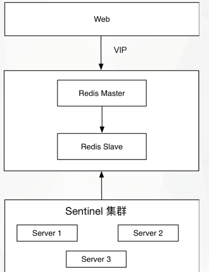
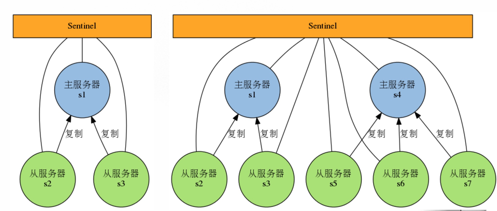
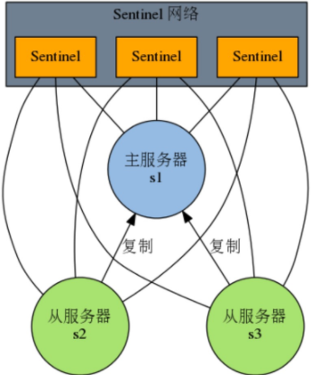

## [Redis 高可用部署方案](https://hoxis.github.io/redis-sentinel-ha.html)

本文主要讲解一种 redis 的高可用方案，使用的是 redis主从 + 哨兵 + VIP 的方式实现。

本次部署是在虚拟机上进行的。

# 原理

## 主从复制

Redis 主从复制模式可以将主节点的数据同步给从节点，从而保障当主节点不可达的情况下，从节点可以作为后备顶上来，并且可以保障数据尽量不丢失（主从复制可以保障最终一致性）。

第二，从节点可以扩展主节点的读能力，一旦主节点不能支持大规模并发量的读操作，从节点可以在一定程度上分担主节点的压力。

[](./pics/1524713134535.jpg)

主从复制面临的问题：

1. 当主节点发生故障的时候，需要手动的将一个从节点晋升为主节点，同时通知应用方修改主节点地址并重启应用，同时需要命令其它从节点复制新的主节点，整个过程需要人工干预。
2. 主节点的写能力受到单机的限制。
3. 主节点的存储能力受到单机的限制。

## Redis Sentinel 原理

[](./pics/1524713006645.jpg)

当主节点出现故障时，Redis Sentinel 能自动完成故障发现和故障转移，并通知应用方，从而实现真正的高可用。RedisSentine 是一个分布式架构，其中包含若干个 Sentinel 节点和 Redis 数据节点，每个 Sentinel 节点会对数据节点和其余 Sentinel 节点进行监控，当它发现节点不可达时，会对节点做下线标识。如果被标识的是**主节点**，它还会和其他的 Sentinel 节点进行协商，当大多数 Sentinel 节点都认为主节点不可达时，它们会选举一个 Sentinel 节点来完成自动故障转移的工作，同时会将这个变化实时通知给 Redis 应用方。整个过程是自动的，不需要人工干预，解决了Redis 的高可用问题。

Redis Sentinel 包含了若干个 Sentinel 节点，这样做也带来了两个好处：

1. 对节点的故障判断是由多个 Sentinel 节点共同完成，这样可以有效的防止误判。
2. Sentinel 节点集合是由若干个 Sentinel 节点组成的，这样即使个别 Sentinel 节点不可用，整个Sentinel节点集合依然是健壮的。

Redis Sentinel 具有以下几个功能：

1. 监控：Sentinel 会定期检测 Redis 数据节点、其余 Sentinel 节点是否可到达
2. 通知：Sentinel 会将故障转移的结果通知给应用方。
3. 主节点故障转移：实现从节点晋升为主节点并维护后续正确的主从关系。
4. 配置提供者：在 RedisSentinel 结构中，客户端在初始化的时候连接的是 Sentinel 节点集合，从中获取主节点信息。

RedisSentinel 处理流程：

1. Sentinel 集群通过给定的配置文件发现 master，启动时会监控 master。通过向 master 发送 info 信息获得该服务器下面的所有从服务器。
2. Sentinel 集群通过命令连接向被监视的主从服务器发送 hello 信息（每秒一次），该信息包括 Sentinel 本身的 IP、端口、id 等内容，以此来向其他 Sentinel 宣告自己的存在。
3. Sentinel 集群通过订阅连接接收其他 Sentinel 发送的 hello 信息，以此来发现监视同一个主服务器的其他 Sentinel；集群之间会互相创建命令连接用于通信，因为已经有主从服务器作为发送和接收 hello 信息的中介，Sentinel 之间不会创建订阅连接。
4. Sentinel 集群使用 ping 命令来检测实例的状态，如果在指定的时间内（down-after-milliseconds）没有回复或则返回错误的回复，那么该实例被判为下线。
5. 当 failover 主备切换被触发后，failover 并不会马上进行，Sentinel 中的大多数 Sentinel 授权后才可以进行 failover，即进行 failover 的 Sentinel 会去获得指定 quorum 个的 Sentinel 的授权，成功后进入 ODOWN 状态。如在 5 个 Sentinel 中配置了 2 个 quorum，等到 2 个 Sentinel 认为 master 死了就执行 failover。
6. Sentinel 向选为 master 的 slave 发送 SLAVEOF NO ONE 命令，选择 slave 的条件是 Sentinel 首先会根据 slaves 的优先级来进行排序，优先级越小排名越靠前。如果优先级相同，则查看复制的下标，哪个从 master 接收的复制数据多，哪个就靠前。如果优先级和下标都相同，就选择进程 ID 较小的。
7. Sentinel 被授权后，它将会获得宕掉的 master 的一份最新配置版本号 (config-epoch)，当 failover 执行结束以后，这个版本号将会被用于最新的配置，通过广播形式通知其它 Sentinel，其它的 Sentinel 则更新对应 master 的配置。

1 到 3 是自动发现机制:

- 以 10 秒一次的频率，向被监视的 master 发送 info 命令，根据回复获取 master 当前信息。
- 以 1 秒一次的频率，向所有 redis 服务器、包含 Sentinel 在内发送 PING 命令，通过回复判断服务器是否在线。与主节点，从节点，其余 Sentinel 都建立起连接，实现了对每个节点的监控。
- 以 2 秒一次的频率，通过向所有被监视的 master，slave 服务器发送当前 Sentinel master 信息的消息。这个定时任务可以完成以下两个工作：
  - 发现新的 Sentinel 节点：通过订阅主节点的 *Sentinel*:hello 了解其他 Sentinel 节点信息。如果是新加入的 Sentinel 节点，将该 Sentinel 节点信息保存起来，并与该 Sentinel 节点创建连接
  - Sentinel 节点之间交换主节点状态，作为后面客观下线以及领导者选举的依据

4 是检测机制，5 和 6 是 failover 机制，7 是更新配置机制

# 环境

## 部署原则

1. Sentinel 节点不应该部署在一台物理机上。
2. 部署至少三个且奇数个的 Sentinel 节点
3. 只有一套 Sentinel，还是每个主节点配置一套 Sentinel 的讨论的建议方案是如果 Sentinel 节点集合监控的是同一个业务的多个主节点集合，那么使用方案一，否则使用方案 2。

## 部署架构

本次使用 redis主从 + 哨兵 + VIP 的架构。

[](./pics/1524712768111.jpg)

## 版本信息

```
# uname -a
Linux centos7 3.10.0-514.26.2.el7.x86_64 #1 SMP Tue Jul 4 15:04:05 UTC 2017 x86_64 x86_64 x86_64 GNU/Linux

# redis-server --version
Redis server v=3.2.10 sha=00000000:0 malloc=jemalloc-3.6.0 bits=64 build=c8b45a0ec7dc67c6
```

## 地址和端口规划

| 应用              | ip            | 端口  |
| ----------------- | ------------- | ----- |
| Redis 主节点      | 192.168.31.63 | 6400  |
| Redis 从从节点    | 192.168.31.64 | 6400  |
| VIP               | 192.168.31.88 |       |
| sentinel 本地节点 | 192.168.31.63 | 26400 |
| sentinel 本地节点 | 192.168.31.64 | 26400 |
| sentinel 仲裁节点 | 192.168.31.66 | 26400 |

# 部署

## 安装 Redis

在 192.168.31.63、192.168.31.64 和 192.168.31.66 节点上执行：

```
yum -y install redis
```

## 配置

- 配置 Redis

修改 192.168.31.63 和 192.168.31.64 节点的 Redis 配置文件（/etc/redis_6400.conf）。

```
daemonize yes

=== 以下根据实际情况修改 ===
pidfile "/var/run/redis_6400.pid"
port 6400
tcp-backlog 65535
bind 0.0.0.0

notify-keyspace-events ""
protected-mode no
requirepass 123456

logfile "/var/log/redis/redis_6400.log"
dir "/data/redis/6400" # 需要提前新建好目录

maxmemory 8gb
maxmemory-policy allkeys-lru

#如果 master 设置了 requirepass，那 slave 要连上 master，需要有 master 的密码才行。
# masterauth 就是用来配置 master 的密码，这样可以在连上 master 后进行认证。 
masterauth 123456

=== 以下配置采用默认配置 ===
timeout 0
tcp-keepalive 0
loglevel notice

databases 16
save 900 1
save 300 10
save 60 10000

stop-writes-on-bgsave-error yes
rdbcompression yes
rdbchecksum yes
dbfilename "dump.rdb"

slave-serve-stale-data yes
slave-read-only yes
repl-disable-tcp-nodelay no
slave-priority 100
appendonly no
appendfilename "appendonly.aof"
appendfsync everysec
no-appendfsync-on-rewrite no
auto-aof-rewrite-percentage 100
auto-aof-rewrite-min-size 64mb

lua-time-limit 5000
slowlog-log-slower-than 10000
slowlog-max-len 128

hash-max-ziplist-entries 512
hash-max-ziplist-value 64
list-max-ziplist-entries 512
list-max-ziplist-value 64
set-max-intset-entries 512
zset-max-ziplist-entries 128
```

redis 配置文件的详细讲解见：[传送门](https://hoxis.github.io/redis-conf.html)

- 修改 sentinel 配置

在 192.168.31.63、192.168.31.64 和 192.168.31.66 节点上编写 sentinel 配置文件（/etc/redis-sentinel6400.conf）

```
daemonize yes
protected-mode no
port 26400
dir "/data/redis/redis_sentinels" # 需要提前新建好目录
pidfile "/var/run/redis/sentinel6400.pid"
logfile "/data/redis/redis_sentinels/sentinel6400.log"

# 监控的 master 的名字叫做 master6400（自定义），地址为192.168.31.63:6400
# 行尾最后的一个 2 代表在 sentinel 集群中，多少个 sentinel 认为 masters 死了，才能真正认为该 master 不可用了。
sentinel monitor master6400 192.168.31.63 6400 2

# sentinel 会向 master 发送心跳 PING 来确认 master 是否存活
# 如果 master 在「一定时间范围内」 不回应 PONG 或者是回复了一个错误消息
# 那么这个 sentinel 会认为这个 master 已经不可用了 (subjectively down, 也简称为SDOWN)。
# 而这个 down-after-milliseconds 就是用来指定这个「一定时间范围内」的，单位是毫秒，默认30秒。
sentinel down-after-milliseconds master6400 6000

# failover 过期时间，当 failover 开始后，在此时间内仍然没有触发任何 failover 操作，
# 当前 sentinel 将会认为此次 failoer 失败。默认180秒，即3分钟。
sentinel failover-timeout master6400 18000

# sentinel 连接设置了密码的主和从
sentinel auth-pass master6400 123456

# 发生切换之后执行的一个自定义脚本：如发邮件、vip切换等
# 仲裁节点无需添加这行配置，client-reconfig-script 参数是在 sentinel 做 failover 的过程中调用脚本漂 vip 到新的 master 上
sentinel client-reconfig-script master6400 /opt/notify_master6400.sh
```

> 注意：要是参数配置的是默认值，在 sentinel 运行时该参数会在配置文件文件里被删除掉，直接不显示。也可以在运行时用命令 SENTINEL SET command 动态修改，后面说明。

很显然，只使用单个 sentinel 进程来监控 redis 集群是不可靠的，当 sentinel 进程宕掉后 （sentinel本身也有单点问题，single-point-of-failure） 整个集群系统将无法按照预期的方式运行。所以有必要将 sentinel 集群，这样有几个好处：

1：即使有一些 sentinel 进程宕掉了，依然可以进行 redis 集群的主备切换；
2：如果只有一个 sentinel 进程，如果这个进程运行出错，或者是网络堵塞，那么将无法实现 redis 集群的主备切换（单点问题）;
3：如果有多个 sentinel，redis 的客户端可以随意地连接任意一个 sentinel 来获得关于redis集群中的信息。

> 注意：当一个 master 配置为需要密码才能连接时，客户端和 slave 在连接时都需要提供密码。master 通过 requirepass 设置自身的密码，不提供密码无法连接到这 个master。slave 通过 masterauth 来设置访问 master 时的密码。客户端需要 auth 提供密码，但是当使用了 sentinel 时，由于一个 master 可能会变成一个 slave，一个 slave 也可能会变成 master，所以需要同时设置上述两个配置项，并且 sentinel 需要连接 master 和 slave，需要设置参数：sentinel auth-pass xxxxx。

- 撰写漂 VIP 的脚本

192.168.31.63、192.168.31.64节点上 /opt/notify_master6400.sh，并赋予可执行权限：

其中的网卡名称根据自己环境进行配置。

```
#!/bin/bash
MASTER_IP=$6
LOCAL_IP='192.168.31.63' # 从库修改为 192.168.31.64
VIP='192.168.31.88'
NETMASK='24'         
INTERFACE='enp0s3' 
if [ ${MASTER_IP} = ${LOCAL_IP} ]; then
         /sbin/ip addr add ${VIP}/${NETMASK} dev ${INTERFACE}
         /sbin/arping -q -c 3 -A ${VIP} -I ${INTERFACE}
        exit 0
else
         /sbin/ip addr del ${VIP}/${NETMASK} dev ${INTERFACE}
        exit 0
fi
exit 1
```

这里大概说一下这个脚本的工作原理，sentinel 在做 failover 的过程中会传出 6 个参数，分别是 `<master-name>`、 `<role>`、 `<state>`、 `<from-ip>`、 `<from-port>`、 `<to-ip>` 、`<to-port>`，其中第 6 个参数 from-ip 也就是新的 master 的 ip，对应脚本中的 MASTER_IP，下面的 if 判断大家应该都很了然了，如果 MASTER_IP=LOCAL_IP，那就绑定 VIP，反之删除 VIP。

# 服务启动和配置

- 启动redis服务

192.168.31.63、192.168.31.64

```
redis-server /etc/redis_6400.conf
```

- 初始化主从

在 Redis 从节点 192.168.31.64 执行：

```
# redis-cli -p 6400 -a 123456 slaveof 192.168.31.63 6400
OK
```

- 绑定VIP到主库

192.168.31.63

```
/sbin/ip addr add 192.168.31.88/24 dev enp0s3
```

- 启动 sentinel 服务

在 192.168.31.63、192.168.31.64 和 192.168.31.66 节点上执行：

```
redis-server /etc/redis-sentinel6400.conf --sentinel
```

## redis-sentinel 日志

```
+reset-master <instance details> -- 当master被重置时.
+slave <instance details> -- 当检测到一个slave并添加进slave列表时.
+failover-state-reconf-slaves <instance details> -- Failover状态变为reconf-slaves状态时
+failover-detected <instance details> -- 当failover发生时
+slave-reconf-sent <instance details> -- sentinel发送SLAVEOF命令把它重新配置时
+slave-reconf-inprog <instance details> -- slave被重新配置为另外一个master的slave，但数据复制还未发生时。
+slave-reconf-done <instance details> -- slave被重新配置为另外一个master的slave并且数据复制已经与master同步时。
-dup-sentinel <instance details> -- 删除指定master上的冗余sentinel时 (当一个sentinel重新启动时，可能会发生这个事件).
+sentinel <instance details> -- 当master增加了一个sentinel时。
+sdown <instance details> -- 进入SDOWN状态时;
-sdown <instance details> -- 离开SDOWN状态时。
+odown <instance details> -- 进入ODOWN状态时。
-odown <instance details> -- 离开ODOWN状态时。
+new-epoch <instance details> -- 当前配置版本被更新时。
+try-failover <instance details> -- 达到failover条件，正等待其他sentinel的选举。
+elected-leader <instance details> -- 被选举为去执行failover的时候。
+failover-state-select-slave <instance details> -- 开始要选择一个slave当选新master时。
no-good-slave <instance details> -- 没有合适的slave来担当新master
selected-slave <instance details> -- 找到了一个适合的slave来担当新master
failover-state-send-slaveof-noone <instance details> -- 当把选择为新master的slave的身份进行切换的时候。
failover-end-for-timeout <instance details> -- failover由于超时而失败时。
failover-end <instance details> -- failover成功完成时。
switch-master <master name> <oldip> <oldport> <newip> <newport> -- 当master的地址发生变化时。通常这是客户端最感兴趣的消息了。
+tilt -- 进入Tilt模式。
-tilt -- 退出Tilt模式。
```

至此，整个高可用方案已经搭建完成。

## 查看主从信息

```
# redis-cli -h 192.168.31.63 -p 6400 -a 123456 info  Replication
# Replication
role:master
connected_slaves:1
slave0:ip=192.168.31.64,port=6400,state=online,offset=20290,lag=1
master_repl_offset:20433
repl_backlog_active:1
repl_backlog_size:1048576
repl_backlog_first_byte_offset:2
repl_backlog_histlen:20432

# redis-cli -h 192.168.31.64 -p 6400 -a 123456 info  Replication
# Replication
role:slave
master_host:192.168.31.63
master_port:6400
master_link_status:up
master_last_io_seconds_ago:0
master_sync_in_progress:0
slave_repl_offset:21434
slave_priority:100
slave_read_only:1
connected_slaves:0
master_repl_offset:0
repl_backlog_active:0
repl_backlog_size:1048576
repl_backlog_first_byte_offset:0
repl_backlog_histlen:0
```

## 查看 sentinel 信息

```
# redis-cli -h 192.168.31.63 -a 123456 -p 26400 info Sentinel
# Sentinel
sentinel_masters:1
sentinel_tilt:0
sentinel_running_scripts:0
sentinel_scripts_queue_length:0
sentinel_simulate_failure_flags:0
master0:name=master6400,status=ok,address=192.168.31.63:6400,slaves=1,sentinels=3
```

## 查看 VIP

VIP 现在是绑定在主节点 192.168.31.63 上的。

```
# ip a|grep enp
2: enp0s3: <BROADCAST,MULTICAST,UP,LOWER_UP> mtu 1500 qdisc pfifo_fast state UP qlen 1000
    inet 192.168.31.63/24 brd 192.168.31.255 scope global enp0s3
    inet 192.168.31.88/24 scope global secondary enp0s3
```

可以看出当前 192.168.31.63 是主节点。

# 测试

## 主从同步测试

```
## 在主节点设置一个 key-value
# redis-cli -h 192.168.31.63 -a 123456 -p 6400 
192.168.31.63:6400> set test0426 tttt
OK
192.168.31.63:6400> get test0426
"tttt"

## 备节点可以同步到数据
# redis-cli -h 192.168.31.64 -a 123456 -p 6400 
192.168.31.64:6400> get test0426
"tttt"

## 并且备节点是只读节点，不可写
192.168.31.64:6400> set uuu s
(error) READONLY You can't write against a read only slave.
```

## 高可用测试

我们 down 掉主节点的 redis，测试下备节点是否可以升级为主节点，并且 VIP 是否可以漂移到备节点。

- 杀掉主节点 redis 进程

```
# ps -ef|grep redis
root     17873     1  0 13:02 ?        00:00:05 redis-sentinel *:26400 [sentinel]
root     18098     1  0 13:18 ?        00:00:01 redis-server *:6400
root     18238  2586  0 13:28 pts/0    00:00:00 grep --color=auto redis

# kill 18098
```

- 查看 Replication 信息

主节点 redis 已无法访问，备节点已升级为主节点。

```
# redis-cli -h 192.168.31.63 -a 123456 -p 6400 info Replication
Could not connect to Redis at 192.168.31.63:6400: Connection refused

# redis-cli -h 192.168.31.64 -a 123456 -p 6400 info Replication
# Replication
role:master
connected_slaves:0
master_repl_offset:0
repl_backlog_active:0
repl_backlog_size:1048576
repl_backlog_first_byte_offset:0
repl_backlog_histlen:0
```

- 查看 Sentinel 信息

同样可以看出 192.168.31.64 已升级为主节点。

```
# redis-cli -h 192.168.31.63 -a 123456 -p 26400 info Sentinel
# Sentinel
sentinel_masters:1
sentinel_tilt:0
sentinel_running_scripts:0
sentinel_scripts_queue_length:0
sentinel_simulate_failure_flags:0
master0:name=master6400,status=ok,address=192.168.31.64:6400,slaves=1,sentinels=3
```

- 查看 VIP 漂移

在 192.168.31.64 执行，可以看出 VIP 漂移成功。

```
ip a|grep enp
2: enp0s3: <BROADCAST,MULTICAST,UP,LOWER_UP> mtu 1500 qdisc pfifo_fast state UP qlen 1000
    inet 192.168.31.64/24 brd 192.168.31.255 scope global enp0s3
    inet 192.168.31.88/24 scope global secondary enp0s3
```

- Sentinel 处理过程日志

192.168.31.63 节点：

```
17873:X 26 Apr 13:10:10.117 # +sdown master master6400 192.168.31.63 6400   ## 进入主观不可用(SDOWN)
17873:X 26 Apr 13:10:10.184 # +odown master master6400 192.168.31.63 6400 #quorum 3/2   ## 投票好了，达到了quorum，进入客观不可用(ODOWN)
17873:X 26 Apr 13:10:10.184 # +new-epoch 48 ## 当前配置版本被更新
17873:X 26 Apr 13:10:10.184 # +try-failover master master6400 192.168.31.63 6400     ## 达到failover条件，正等待其他sentinel的选举
17873:X 26 Apr 13:10:10.207 # +vote-for-leader 500a19751ae3ae62af939699421ad53555b12b12 48  ## 选举
17873:X 26 Apr 13:10:10.274 # db11c4e93efa99b49c59fc30b37b8433c43857fa voted for db11c4e93efa99b49c59fc30b37b8433c43857fa 48    ## 选举
17873:X 26 Apr 13:10:10.281 # 7d031766571bc456cf087a082ff50cfa3934e1ff voted for 500a19751ae3ae62af939699421ad53555b12b12 48    ## 选举
17873:X 26 Apr 13:10:10.336 # +elected-leader master master6400 192.168.31.63 6400      ## 执行failover
17873:X 26 Apr 13:10:10.336 # +failover-state-select-slave master master6400 192.168.31.63 6400     ## 开始要选择一个slave当选新master
17873:X 26 Apr 13:10:10.437 # +selected-slave slave 192.168.31.64:6400 192.168.31.64 6400 @ master6400 192.168.31.63 6400    ## 找到了一个适合的slave来担当新master
17873:X 26 Apr 13:10:10.438 * +failover-state-send-slaveof-noone slave 192.168.31.64:6400 192.168.31.64 6400 @ master6400 192.168.31.63 6400    ## 当把选择为新master的slave的身份进行切换
17873:X 26 Apr 13:10:10.528 * +failover-state-wait-promotion slave 192.168.31.64:6400 192.168.31.64 6400 @ master6400 192.168.31.63 6400
17873:X 26 Apr 13:10:11.391 # +promoted-slave slave 192.168.31.64:6400 192.168.31.64 6400 @ master6400 192.168.31.63 6400
17873:X 26 Apr 13:10:11.391 # +failover-state-reconf-slaves master master6400 192.168.31.63 6400    ## Failover状态变为reconf-slaves
17873:X 26 Apr 13:10:11.479 # +failover-end master master6400 192.168.31.63 6400    ## failover成功完成
17873:X 26 Apr 13:10:11.479 # +switch-master master6400 192.168.31.63 6400 192.168.31.64 6400   ## master的地址发生变化
17873:X 26 Apr 13:10:11.480 * +slave slave 192.168.31.63:6400 192.168.31.63 6400 @ master6400 192.168.31.64 6400
17873:X 26 Apr 13:10:17.539 # +sdown slave 192.168.31.63:6400 192.168.31.63 6400 @ master6400 192.168.31.64 6400     ## 原主进入主观不可用状态
```

## 数据恢复测试

在原主节点 192.168.31.63 未恢复的情况下，往 192.168.31.64 写数据，看 192.168.31.63 恢复后是否可以同步到数据。

```
# redis-cli -h 192.168.31.64 -a 123456 -p 6400 
192.168.31.64:6400> set hoxis hh
OK
192.168.31.64:6400> get hoxis
"hh"

# redis-cli -h 192.168.31.63 -a 123456 -p 6400 
192.168.31.63:6400> get hoxis
"hh"
```

可以恢复成功，当然，数据量大时，数据同步是需要一定的时间的。

# 其他

## Leader 选举

其实在 sentinels 故障转移中，仍然需要一个 Leader 来调度整个过程：master 的选举以及 slave 的重配置和同步。当集群中有多个 sentinel 实例时，如何选举其中一个 sentinel 为 leader 呢？

在配置文件中 can-failover、quorum 参数，以及 is-master-down-by-addr 指令配合来完成整个过程。

1. can-failover 用来表明当前 sentinel 是否可以参与 failover 过程，如果为 YES 则表明它将有能力参与 Leader 的选举，否则它将作为 Observer ，observer 参与 leader 选举投票但不能被选举；
2. quorum 不仅用来控制 master ODOWN 状态确认，同时还用来选举 leader 时最小「赞同票」数；
3. is-master-down-by-addr，在上文中以及提到，它可以用来检测 ip + port 的 master 是否已经处于 SDOWN 状态，不过此指令不仅能够获得 master 是否处于 SDOWN，同时它还额外的返回当前 sentinel 本地「投票选举」的 Leader 信息 (runid);

每个 sentinel 实例都持有其他的 sentinels 信息，在 Leader 选举过程中（当为 leader 的 sentinel 实例失效时，有可能 master server 并没失效，注意分开理解），sentinel 实例将从所有的 sentinels 集合中去除 can-failover = no 和状态为 SDOWN 的 sentinels，在剩余的 sentinels 列表中按照 runid 按照「字典」顺序排序后，取出 runid 最小的 sentinel 实例，并将它「投票选举」为 Leader，并在其他 sentinel 发送的 is-master-down-by-addr 指令时将推选的 runid 追加到响应中。每个 sentinel 实例都会检测 is-master-down-by-addr 的响应结果，如果「投票选举」的 leader 为自己，且状态正常的 sentinels 实例中，赞同者的自己的 sentinel 个数不小于(>=) 50% + 1,且不小与 ，那么此 sentinel 就会认为选举成功且 leader 为自己。

在 sentinel.conf 文件中，我们期望有足够多的 sentinel 实例配置 can-failovers，这样能够确保当 leader 失效时，能够选举某个 sentinel 为 leader，以便进行 failover。如果 leader 无法产生，比如较少的 sentinels 实例有效，那么 failover 过程将续。

## failover 过程

在 Leader 触发 failover 之前，首先 wait 数秒（随机 0~5），以便让其他 sentinel 实例准备和调整，如果一切正常，那么 leader 就需要开始将一个 salve 提升为 master，此 slave 必须为状态良好（不能处于 SDOWN/ODOWN 状态）且权重值最低（redis.conf中）的，当 master 身份被确认后，开始 failover：

1. +failover-triggered: Leader 开始进行 failover，此后紧跟着 +failover-state-wait-start ，wait 数秒。
2. +failover-state-select-slave: Leader 开始查找合适的 slave
3. +selected-slave: 已经找到合适的 slave
4. +failover-state-sen-slaveof-noone: Leader 向 slave 发送 slaveof no one 指令，此时 slave 已经完成角色转换，此 slave 即为 master
5. +failover-state-wait-promotition: 等待其他 sentinel 确认 slave
6. +promoted-slave：确认成功
7. +failover-state-reconf-slaves: 开始对 slaves 进行 reconfig 操作。
8. +slave-reconf-sent: 向指定的 slave 发送 slaveof 指令，告知此 slave 跟随新的 master
9. +slave-reconf-inprog: 此 slave 正在执行 slaveof + SYNC 过程，如过 slave 收到 +slave-reconf-sent 之后将会执行 slaveof 操作。
10. +slave-reconf-done: 此 slave 同步完成，此后 leader 可以继续下一个 slave 的 reconfig 操作。循环步骤 10
11. +failover-end: 故障转移结束
12. +switch-master：故障转移成功后，各个 sentinel 实例开始监控新的 master。

# 总结

Redis-Sentinel 是 Redis 官方推荐的高可用性解决方案，Redis-sentinel 本身也是一个独立运行的进程，它能监控多个 master-slave 集群，发现 master 宕机后能进行自动切换。Sentinel 可以监视任意多个主服务器（复用），以及主服务器属下的从服务器，并在被监视的主服务器下线时，自动执行故障转移操作。

[](./pics/1524722425463.jpg)

为了防止 sentinel 的单点故障，可以对 sentinel 进行集群化，创建多个 sentinel。

[](./pics/1524791740641.jpg)

本文中所使用的 Redis Sentinel 集群 + VIP + 自定义脚本的优缺点：

优点：

- 秒级切换，在 5s 内完成整个切换操作
- 脚本自定义，架构可控
- 对应用透明，前端不用担心后端发生什么变化

缺点：

- 维护成本略高，Redis Sentinel 集群建议投入 3 台机器以上
- 使用 VIP 增加维护成本，存在 IP 混乱风险
- Sentinel 模式存在短时间的服务不可用

------

参考：

1. <http://blog.51cto.com/navyaijm/1745569>
2. <http://www.cnblogs.com/zhoujinyi/p/5570024.html>
3. <https://blog.csdn.net/sunhuiliang85/article/details/78361211>
4. <https://dbarobin.com/2017/05/27/ha-of-redis/>
